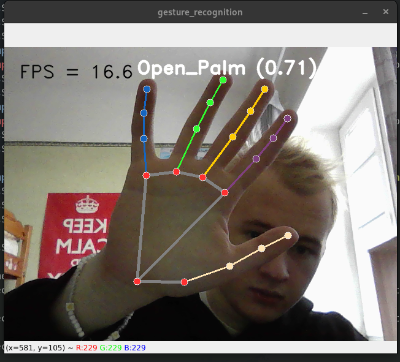

# Mediapipe gesture recognition

Repository for computer vision functionality of Microcontroller's coursework (3rd course, 5th semester)

## Setup

To install project dependenccies, run

```bash
# Make setup script executable
chmod +x setup.sh 

# Use of virtual environment is encouraged
python -m venv venv
source venv/bin/activate

# Pip install and download the model
./setup.sh
```

## Run

### GUI Demo



To run the demo with GUI, run

```bash
python3 demo.py --model gesture_recognizer.task
```


